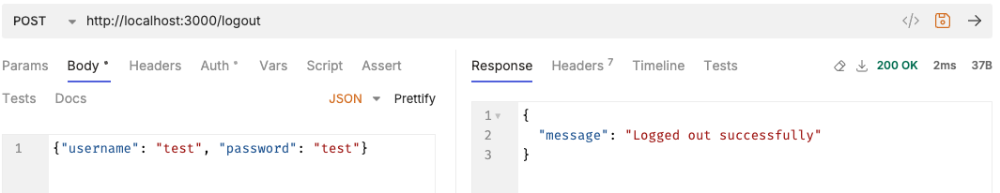

# Express.js

## Hello World

- https://expressjs.com/en/starter/hello-world.html

```js
const express = require("express");
const app = express();
const port = 3000;

app.get("/", (req, res) => {
  res.send("Hello World!");
});

app.listen(port, () => {
  console.log(`Example app listening on port ${port}`);
});
```

## Middleware

- https://expressjs.com/en/guide/writing-middleware.html
  - Middleware is a functions that have access to the request object (req), the response object (res), and the next function in the application’s request-response cycle.
- https://expressjs.com/en/guide/using-middleware.html

### Application-level middleware

- Bind application-level middleware to an instance of the app object by using the app.use() and app.METHOD().

```js
const express = require("express");
const app = express();

app.use((req, res, next) => {
  console.log("Time:", Date.now());
  next();
});
```

### Application-level middleware with mount path

- This middleware is executed for any type of HTTP request on the /user/:id path.

```js
app.use("/user/:id", (req, res, next) => {
  console.log("Request Type:", req.method);
  next();
});

app.get("/user/:id", (req, res, next) => {
  res.send("USER");
});
```

### Router-level middleware

```js
const express = require("express");
const app = express();
const router = express.Router();

// a middleware function with no mount path. This code is executed for every request to the router
router.use((req, res, next) => {
  console.log("Time:", Date.now());
  next();
});
```

### Router-level middleware with mount path

```js
// a middleware sub-stack shows request info for any type of HTTP request to the /user/:id path
router.use(
  "/user/:id",
  (req, res, next) => {
    console.log("Request URL:", req.originalUrl);
    next();
  },
  (req, res, next) => {
    console.log("Request Type:", req.method);
    next();
  }
);
```

### Error-handling middleware

- Error-handling middleware always takes four arguments `(err, req, res, next)`. The arguments cannot omit.

  ```js
  app.use((err, req, res, next) => {
    console.error(err.stack);
    res.status(500).send("Something broke!");
  });
  ```

- **Synchronous** - No extra work; If synchronous code throws an error, then Express will catch and process it.
- **Asynchronous** - You must catch errors that occur in asynchronous code invoked by route handlers or middleware

```js
app.get("/", (req, res, next) => {
  setTimeout(() => {
    try {
      throw new Error("BROKEN");
    } catch (err) {
      next(err);
    }
  }, 100);
});
```

**Example**

// movies.js

```js
router.get("/:id", (req, res, next) => {
  const currentMovie = movies.filter((movie) => movie.id == req.params.id);
  if (currentMovie.length === 0) {
    const error = new Error("Not Found the movie!!");
    error.statusCode = 404;
    next(error);
  } else {
    res.json(currentMovie[0]);
  }
});

// Error handling middleware placed on the bottom
router.use((err, req, res, next) => {
  res.status(err.statusCode || 500).json({ message: err.message });
});
```

## express.Router

- https://expressjs.com/en/guide/routing.html
- Use the `express.Router` class to create modular, mountable route handlers.

**movies.js**

- Create a router file named movies.js in the routes directory

```js
const express = require("express");
const router = express.Router();

const movies = [
  { id: 101, name: "Fight Club", year: 1999, rating: 8.1 },
  { id: 102, name: "Inception", year: 2010, rating: 8.7 },
  { id: 103, name: "The Dark Knight", year: 2008, rating: 9 },
  { id: 104, name: "12 Angry Men", year: 1957, rating: 8.9 },
];

//localhost:3000/movies
router.get("/", (req, res) => {
  res.json(movies);
});

//localhost:3000/movies/10
router.get("/:id", (req, res, next) => {
  const currentMovie = movies.filter((movie) => movie.id == req.params.id);
  res.json(currentMovie[0]);
});

module.exports = router;
```

**index.js**

- Load the router module in the app:

```js
const movies = require("./routes/movies");
app.use("/movies", movies);
```

<hr />

## REST APIs (GET, POST, PUT, DELETE)

- [movies.js](routes/movies.js)

## Response methods

- https://expressjs.com/en/guide/routing.html
- [res.json()](https://expressjs.com/en/5x/api.html#res.json) - Send a JSON response.
- [res.redirect()](https://expressjs.com/en/5x/api.html#res.redirect) - Redirect a request.
- [res.send()](https://expressjs.com/en/5x/api.html#res.send) - Send a response of various types.

## Authentication with JWT

- [auth.js](./auth.js)

**Register**

```js
const express = require("express");
const jwt = require("jsonwebtoken");
const bcrypt = require("bcrypt");

const app = express();
app.use(express.json());

const JWT_SECRET = "your-secret-key";

const users = [];

app.get("/", (req, res) => {
  res.send("Hello World!" + JSON.stringify(users));
});

app.post("/register", async (req, res) => {
  try {
    const { username, password } = req.body;

    const existingUser = users.find((user) => user.username === username);
    if (existingUser) {
      return res.status(400).json({ message: "Username already taken" });
    }

    const hashedPassword = await bcrypt.hash(password, 10);

    const newUser = { username, password: hashedPassword };
    users.push(newUser);

    res.status(201).json({ message: "User created successfully" });
  } catch (error) {
    console.error(error);
    res.status(500).json({ message: "Server error" });
  }
});
```


<hr />

**Login**

```js
app.post("/login", async (req, res) => {
  try {
    const { username, password } = req.body;

    const user = users.find((user) => user.username === username);
    if (!user) {
      return res.status(400).json({ message: "Invalid credentials" });
    }

    const passwordMatch = await bcrypt.compare(password, user.password);
    if (!passwordMatch) {
      return res.status(401).json({ message: "Invalid credentials" });
    }

    const token = jwt.sign({ username: user.username }, JWT_SECRET, {
      expiresIn: "1h",
    });

    res.json({ message: "Logged in successfully", token });
  } catch (error) {
    console.error(error);
    res.status(500).json({ message: "Server error" });
  }
});
```


<hr />

**Logout**

```js
app.post("/logout", (req, res) => {
  // Client-side should remove the token
  res.json({ message: "Logged out successfully" });
});
```



## References

- [HTTP status codes](https://en.wikipedia.org/wiki/List_of_HTTP_status_codes#4xx_client_errors)
- https://expressjs.com/en/guide/writing-middleware.html
- https://expressjs.com/en/5x/api.html
- **Bruno**: https://www.usebruno.com/
- https://expressjs.com/en/starter/basic-routing.html
- https://www.tutorialspoint.com/expressjs/expressjs_http_methods.htm
- https://www.geeksforgeeks.org/error-handling-in-express/
- https://www.tutorialspoint.com/expressjs/expressjs_restful_apis.htm
